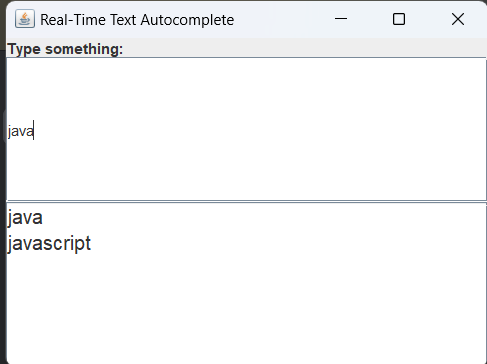
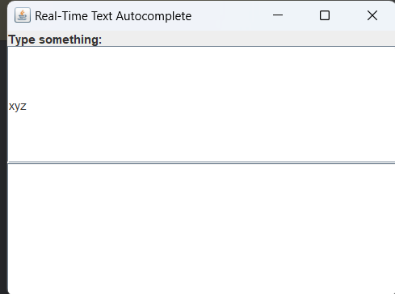

# Real-Time Text Autocomplete

## Overview
This is a **Real-Time Text Autocomplete** application built using **Java Swing**. It provides real-time word suggestions based on user input. The program uses a **Trie (prefix tree)** for efficient storage and retrieval of words.

---

## Features
1. **Real-Time Suggestions**:
    - Displays relevant suggestions as the user types in the text field.
2. **Preloaded Dictionary**:
    - Includes a set of predefined words for testing the autocomplete functionality.
3. **Case-Insensitive Search**:
    - Suggestions are provided regardless of the case of input.
4. **Clean GUI**:
    - Simple and responsive graphical interface using Swing.

---

## Methods Used

### **Core Data Structure**
- **Trie (Prefix Tree)**:
    - A tree-based data structure used for fast prefix-based searches.

### **Core Methods**
1. **`insert(String word)`**:
    - Inserts a word into the Trie.
2. **`getWordsStartingWith(String prefix)`**:
    - Retrieves all words in the Trie that start with a given prefix.
3. **`collectAllWords(TrieNode node, StringBuilder prefix, List<String> results)`**:
    - Recursively collects all words from a given Trie node.

---

## How to Use
1. **Run the Program**:
    - Execute the `TextAutocomplete` class.
2. **Enter Input**:
    - Start typing in the text field at the top of the application.
3. **View Suggestions**:
    - Relevant word suggestions appear dynamically in the list below.
4. **Select a Suggestion (Optional)**:
    - Suggestions are for display only, but the program can be extended to allow selection.

---

## Example

### Preloaded Words
The dictionary includes the following words:
- `apple`, `application`, `appreciate`
- `banana`, `basket`
- `cat`, `dog`, `dolphin`
- `elephant`, `fish`, `grape`
- `java`, `javascript`
- `orange`, `pear`, `zebra`

### Usage Example
#### **Input**: `ap`
#### **Output Suggestions**:
- `apple`
- `application`
- `appreciate`

#### **Input**: `java`
#### **Output Suggestions**:
- `java`
- `javascript`

#### **Input**: `xyz`
#### **Output Suggestions**:
- (No suggestions)

---

